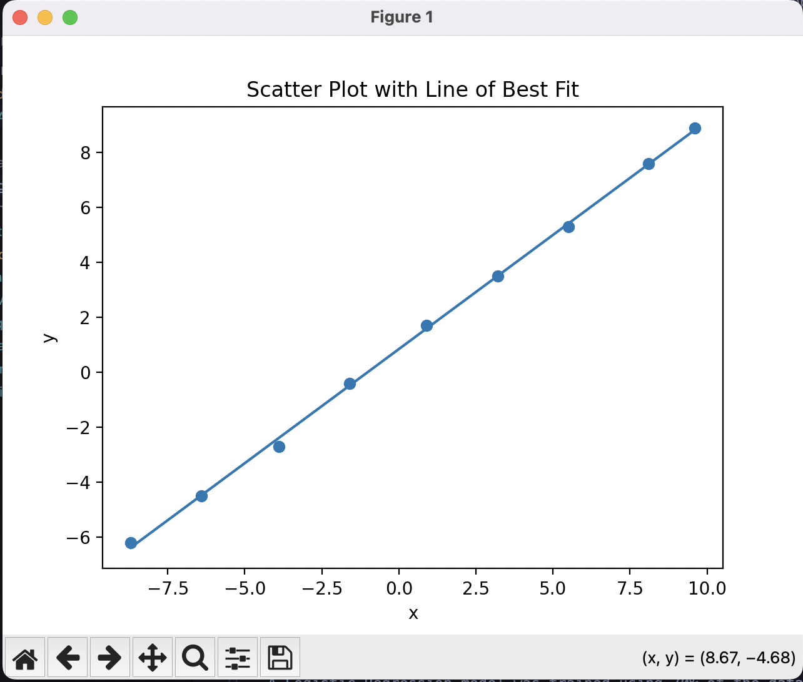
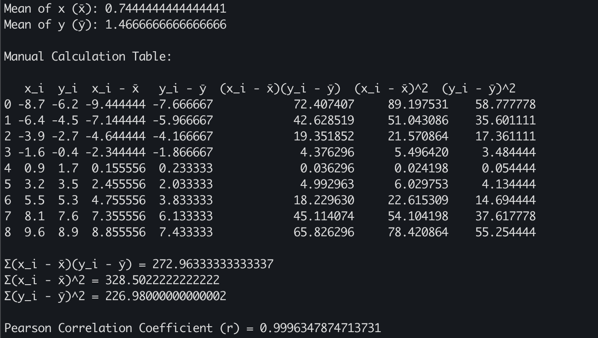

Finding the correlation (find_the_correlation.py)

This program computes the Pearson correlation coefficient to measure the strength and direction of the linear relationship between two numerical variables. The implementation performs both manual calculations and graphical visualization to validate the result.
The program begins by computing the mean of both variables. It then calculates the deviation of each value from its mean, followed by the product of deviations and squared deviations, which are required for Pearson’s correlation formula.

All intermediate values are organized into a tabular format using a Pandas DataFrame. This table clearly demonstrates the step-by-step manual computation process.
A scatter plot of the data points is generated using Matplotlib. Additionally, a line of best fit is computed using least squares regression and plotted alongside the data. This visualization provides a graphical confirmation of the linear relationship indicated by the correlation coefficient.
The program successfully computes the Pearson correlation coefficient and presents both numerical and visual evidence of the relationship between the two variables. The strong alignment of data points along the regression line confirms the strength and direction of the linear correlation.

Spam email detection

  

  

  

Spam Email Detection Using Logistic Regression
Step 1: Dataset Description and Loading

The dataset was loaded from a CSV file using the pandas library. It consists of multiple observations representing individual emails. Each observation contains four numerical features describing email characteristics: total word count, number of embedded links, number of capitalized words, and spam-related keyword count. The target variable is_spam indicates whether an email is spam (1) or legitimate (0).

Step 2: Feature Selection and Target Definition

Four input features were selected for model training: words, links, capital_words, and spam_word_count. These features were chosen because they capture common patterns associated with spam emails. The binary target variable is_spam was used for supervised learning.

Step 3: Train–Test Split

The dataset was divided into training and testing subsets using a 70%–30% split. The training set was used to fit the model, while the test set was reserved for evaluating model performance on unseen data. A fixed random seed was applied to ensure reproducibility of results.

Step 4: Model Training

A Logistic Regression classifier was trained on the training dataset. Logistic Regression was selected due to its suitability for binary classification problems and its interpretability. The maximum number of iterations was increased to ensure model convergence.

Step 5: Model Coefficient Analysis

After training, the coefficients of the Logistic Regression model were extracted and displayed. These coefficients represent the influence of each feature on the probability of an email being classified as spam. Positive coefficients indicate that higher feature values increase the likelihood of spam classification, while negative coefficients indicate the opposite.

Step 6: Model Evaluation

The trained model was evaluated using the test dataset. Predictions were generated and assessed using a confusion matrix and accuracy metric. The confusion matrix provides a detailed breakdown of true positives, true negatives, false positives, and false negatives. The accuracy score measures the proportion of correctly classified emails among all test samples.

Step 7: Confusion Matrix Visualization

A heatmap visualization of the confusion matrix was created to provide an intuitive graphical representation of the model’s classification performance. Correct predictions appear along the diagonal of the matrix, while misclassifications appear off-diagonal. This visualization confirms the model’s effectiveness in distinguishing spam from legitimate emails.

Step 8: Class Distribution Visualization

A bar chart was generated to illustrate the distribution of spam and legitimate emails in the dataset. This visualization helps assess whether the dataset is balanced. An approximately balanced class distribution supports reliable model training and evaluation.

Step 9: Feature-Based Email Classification

The application includes functionality to classify emails based on manually provided feature values. Users can input numerical characteristics such as word count and number of links, and the trained model predicts whether the email is spam or legitimate. This demonstrates direct usage of the trained classifier for structured input data.

Step 10: Text-Based Email Classification

In addition to numerical inputs, the system supports classification of raw email text. The email content is processed to extract the same features used during model training. These extracted features are then passed to the trained Logistic Regression model to generate a classification and an associated spam probability score.

Step 11: Example Email Classification

Two example emails were evaluated: one intentionally crafted to resemble spam and one representing a legitimate message. The spam email contained multiple spam-related keywords, capitalized words, and links, while the legitimate email used neutral language and lacked spam indicators. The model correctly classified both examples, demonstrating its practical effectiveness.

Conclusion

This project demonstrates the successful application of Logistic Regression for spam email detection. By combining structured numerical features with text-based feature extraction, the system effectively classifies emails as spam or legitimate. The evaluation metrics and visualizations confirm strong model performance, while the modular design supports extensibility and practical use.
